# MCP Agent Mail - Library Specification

This document captures the core functionality that needs to be encapsulated for a JavaScript/TypeScript library implementation.

## Overview

MCP Agent Mail is an inter-agent communication system that enables AI coding agents to communicate with each other across different projects and repositories. The system provides:

- **Message passing** between agents with threading and acknowledgements
- **Agent identity** management with memorable auto-generated names
- **File reservation** system for coordinating concurrent file access
- **Contact management** for cross-project agent relationships
- **Git-backed storage** for human-auditable history

---

## System Architecture

```mermaid
flowchart TB
    subgraph Clients["AI Coding Agents"]
        CC[Claude Code]
        CX[Codex]
        CR[Cursor]
        OT[Other Tools]
    end

    subgraph MCP["MCP Agent Mail Server"]
        subgraph Tools["MCP Tool Interface"]
            TI[Identity Tools]
            TM[Messaging Tools]
            TF[File Reservation Tools]
            TC[Contact Tools]
            TS[Search Tools]
        end

        subgraph Core["Core Operations"]
            OP[Operations Layer]
            CFG[Configuration]
            LOG[Logging]
        end

        subgraph Persistence["Dual Persistence"]
            DB[(SQLite + FTS5)]
            GIT[Git Archive]
        end
    end

    CC & CX & CR & OT -->|JSON-RPC| Tools
    Tools --> OP
    OP --> CFG
    OP --> LOG
    OP --> DB
    OP --> GIT

    style MCP fill:#1a1a2e,stroke:#16213e
    style Tools fill:#0f3460,stroke:#16213e
    style Core fill:#533483,stroke:#16213e
    style Persistence fill:#e94560,stroke:#16213e
```

---

## Entity Relationship Diagram

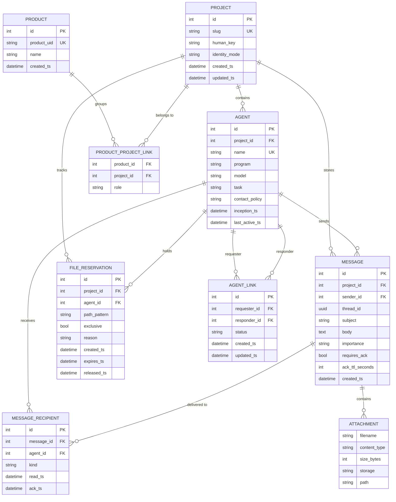

---

## Core Data Models

### Project

The namespace container for agents and messages.

```typescript
interface Project {
  id: number;
  slug: string;              // URL-safe identifier (e.g., "my-repo")
  human_key: string;         // Human-readable name
  identity_mode: ProjectIdentityMode;
  created_ts: Date;
  updated_ts: Date;
}

type ProjectIdentityMode =
  | "dir"           // Use directory name
  | "git-remote"    // Use git remote URL
  | "git-common-dir"// Use git common directory
  | "git-toplevel"; // Use git top-level directory
```

### Agent

Represents a coding agent (Claude Code, Codex, Cursor, etc.).

```typescript
interface Agent {
  id: number;
  project_id: number;
  name: string;              // Auto-generated: "GreenLake", "RedCastle"
  program: string;           // "claude-code", "codex", "cursor", etc.
  model: string;             // "opus-4", "gpt-5", etc.
  task: string;              // Current task description
  inception_ts: Date;
  last_active_ts: Date;

  // Policies
  attachments_policy: AttachmentsPolicy;
  contact_policy: ContactPolicy;
}

type AttachmentsPolicy = "accept" | "reject" | "ask";
type ContactPolicy = "open" | "auto" | "contacts_only" | "block_all";
```

### Message

The core communication unit.

```typescript
interface Message {
  id: number;
  project_id: number;
  sender_id: number;
  thread_id: string;         // UUID for grouping conversations
  subject: string;
  body: string;              // Markdown content
  importance: ImportanceLevel;
  requires_ack: boolean;
  ack_ttl_seconds?: number;
  attachments: Attachment[]; // JSON array
  created_ts: Date;
}

type ImportanceLevel = "low" | "normal" | "high" | "urgent";

interface Attachment {
  filename: string;
  content_type: string;
  size_bytes: number;
  storage: "file" | "inline";
  path?: string;             // For file storage
  data?: string;             // Base64 for inline
}
```

### MessageRecipient

Tracks per-recipient delivery state.

```typescript
interface MessageRecipient {
  id: number;
  message_id: number;
  agent_id: number;
  kind: DeliveryKind;
  read_ts?: Date;
  ack_ts?: Date;
}

type DeliveryKind = "to" | "cc" | "bcc";
```

### FileReservation

Advisory file leases for coordinating concurrent access.

```typescript
interface FileReservation {
  id: number;
  project_id: number;
  agent_id: number;
  path_pattern: string;      // Glob pattern: "src/**/*.ts"
  exclusive: boolean;
  reason?: string;
  created_ts: Date;
  expires_ts: Date;
  released_ts?: Date;
}
```

### AgentLink

Cross-project contact relationships.

```typescript
interface AgentLink {
  id: number;
  requester_id: number;
  responder_id: number;
  status: LinkStatus;
  created_ts: Date;
  updated_ts: Date;
}

type LinkStatus = "pending" | "approved" | "blocked";
```

### Product (Optional)

Logical grouping across multiple repositories.

```typescript
interface Product {
  id: number;
  product_uid: string;
  name: string;
  created_ts: Date;
}

interface ProductProjectLink {
  product_id: number;
  project_id: number;
  role: string;              // "primary", "secondary", etc.
}
```

---

## Core Operations

### 1. Project Management

```typescript
interface ProjectOperations {
  // Create or retrieve a project
  ensureProject(options: {
    slug: string;
    humanKey?: string;
    identityMode?: ProjectIdentityMode;
  }): Promise<Project>;

  // Resolve project identity from git metadata
  resolveProjectIdentity(repoPath: string): Promise<{
    slug: string;
    humanKey: string;
  }>;
}
```

### 2. Agent Identity

```typescript
interface AgentOperations {
  // Register a new agent
  registerAgent(options: {
    projectId: number;
    name?: string;           // Auto-generated if not provided
    program: string;
    model: string;
    task?: string;
  }): Promise<Agent>;

  // Lookup agent by name
  whois(projectId: number, name: string): Promise<Agent | null>;

  // Generate unique agent name
  generateAgentName(): string;

  // Validate agent name format
  validateAgentName(name: string): boolean;

  // Update agent's last active timestamp
  touchAgent(agentId: number): Promise<void>;
}
```

**Agent Name Generation:**
- Combines adjective + noun (e.g., "GreenLake", "SwiftFox")
- 62 adjectives x 69 nouns = 4,278 unique combinations
- Names are project-scoped (unique within a project)

### 3. Messaging

#### Message Flow Sequence

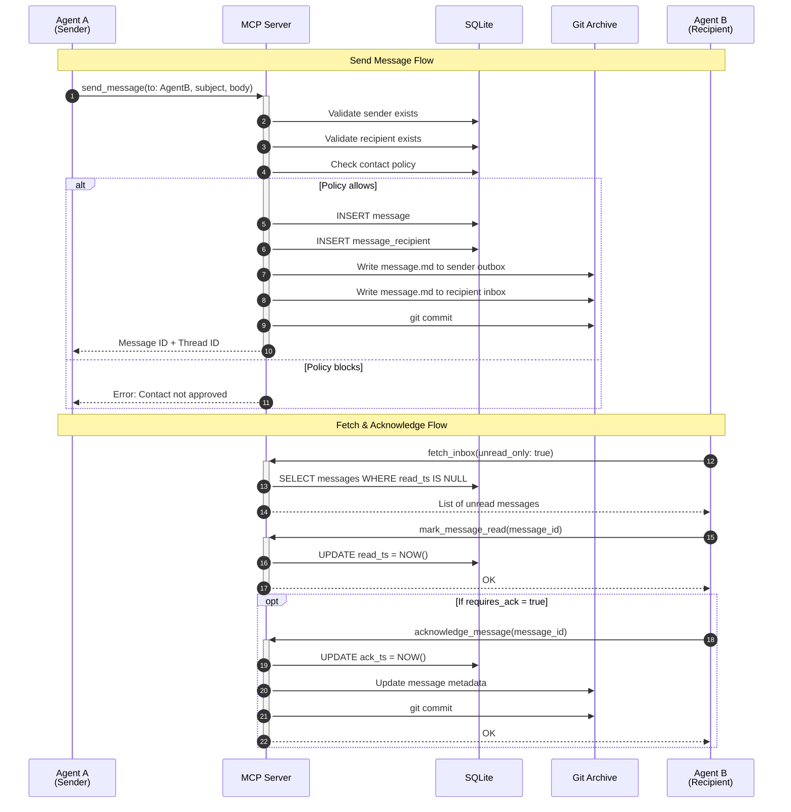

```typescript
interface MessagingOperations {
  // Send a message to one or more agents
  sendMessage(options: {
    senderId: number;
    recipients: Array<{
      agentId: number;
      kind: DeliveryKind;
    }>;
    subject: string;
    body: string;
    threadId?: string;       // Auto-generated if not provided
    importance?: ImportanceLevel;
    requiresAck?: boolean;
    ackTtlSeconds?: number;
    attachments?: AttachmentInput[];
  }): Promise<Message>;

  // Reply to an existing message (inherits thread)
  replyMessage(options: {
    senderId: number;
    originalMessageId: number;
    body: string;
    attachments?: AttachmentInput[];
  }): Promise<Message>;

  // Fetch inbox messages
  fetchInbox(options: {
    agentId: number;
    unreadOnly?: boolean;
    limit?: number;
    offset?: number;
    since?: Date;
  }): Promise<Message[]>;

  // Mark message as read
  markRead(messageId: number, agentId: number): Promise<void>;

  // Acknowledge message
  acknowledge(messageId: number, agentId: number): Promise<void>;

  // Search messages (full-text)
  searchMessages(options: {
    projectId: number;
    query: string;           // FTS5 query syntax
    agentId?: number;
    threadId?: string;
    limit?: number;
  }): Promise<Message[]>;
}
```

### 4. File Reservations

#### File Reservation Workflow

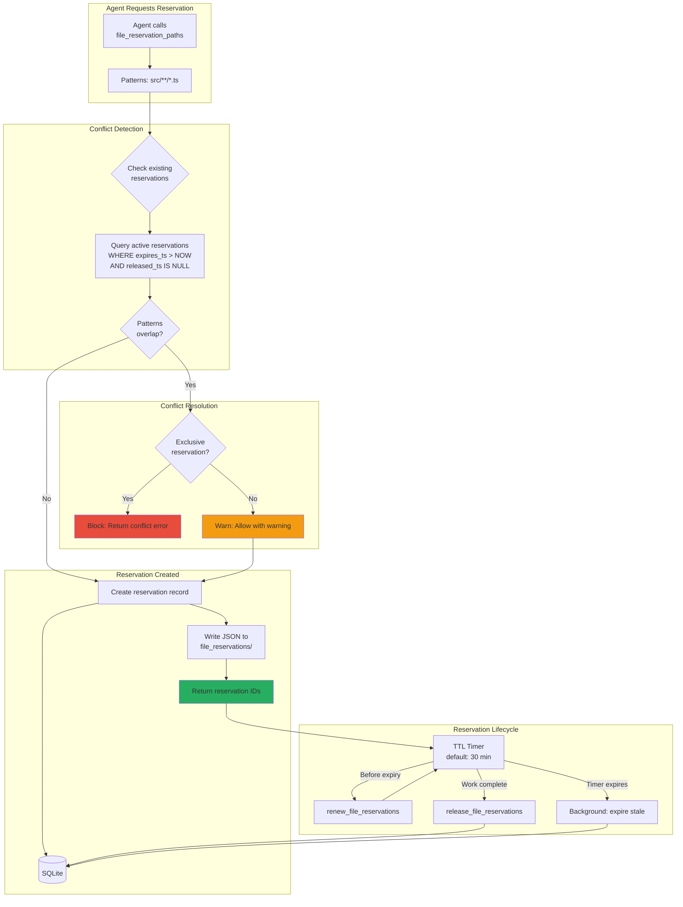

#### Conflict Detection Logic

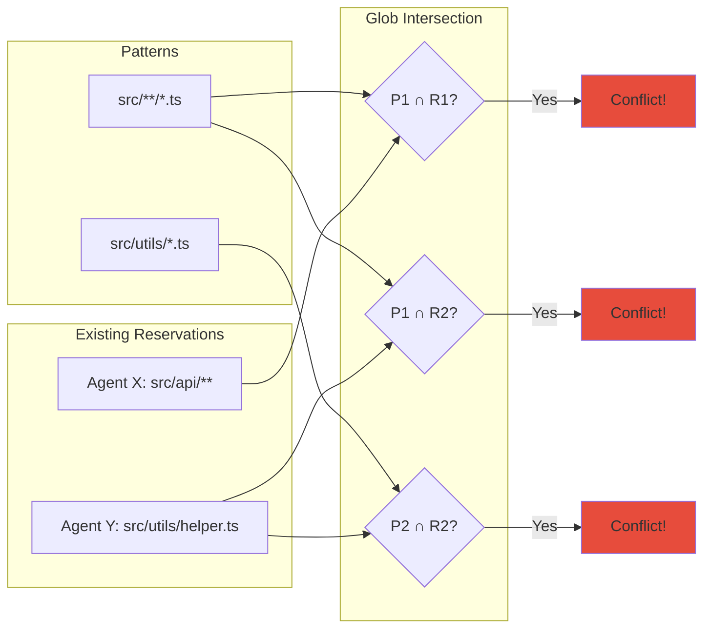

```typescript
interface FileReservationOperations {
  // Create file reservations
  reserveFiles(options: {
    agentId: number;
    patterns: string[];      // Glob patterns
    exclusive?: boolean;
    reason?: string;
    ttlSeconds?: number;
  }): Promise<FileReservation[]>;

  // Release reservations
  releaseReservations(reservationIds: number[]): Promise<void>;

  // Renew reservation TTL
  renewReservations(
    reservationIds: number[],
    ttlSeconds: number
  ): Promise<void>;

  // Check for conflicts
  checkConflicts(options: {
    agentId: number;
    patterns: string[];
  }): Promise<ConflictReport>;

  // List active reservations
  listReservations(projectId: number): Promise<FileReservation[]>;

  // Expire stale reservations (background task)
  expireStaleReservations(): Promise<number>;
}

interface ConflictReport {
  hasConflicts: boolean;
  conflicts: Array<{
    pattern: string;
    conflictingReservation: FileReservation;
    conflictingAgent: Agent;
  }>;
}
```

### 5. Contact Management

#### Contact Handshake Sequence

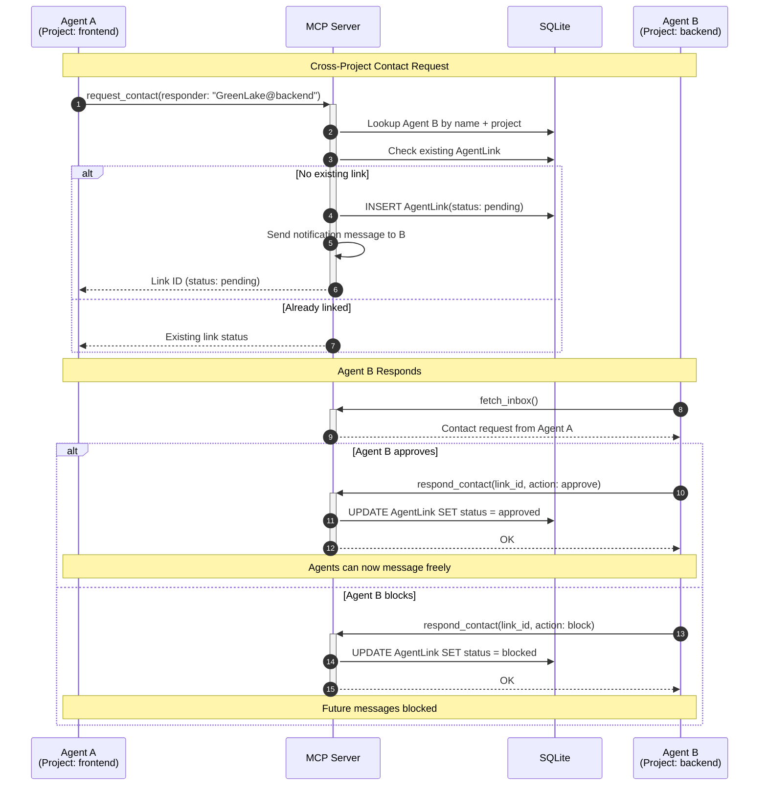

#### Contact Policy State Machine

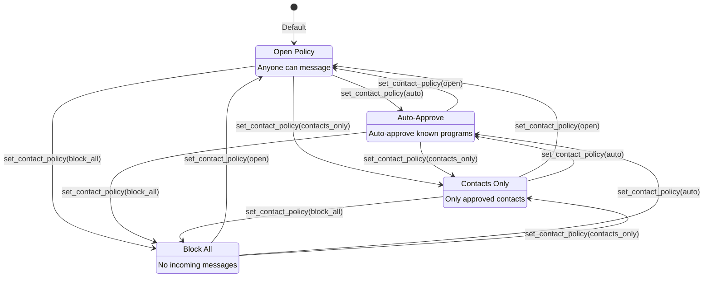

```typescript
interface ContactOperations {
  // Request contact with another agent
  requestContact(options: {
    requesterId: number;
    responderId: number;
    message?: string;
  }): Promise<AgentLink>;

  // Respond to contact request
  respondContact(options: {
    linkId: number;
    action: "approve" | "block";
  }): Promise<AgentLink>;

  // List contacts for an agent
  listContacts(agentId: number): Promise<AgentLink[]>;

  // Set agent's contact policy
  setContactPolicy(
    agentId: number,
    policy: ContactPolicy
  ): Promise<void>;
}
```

### 6. Workflow Macros

High-level operations combining multiple steps.

#### Agent Session Lifecycle

```mermaid
sequenceDiagram
    autonumber
    participant AI as AI Coding Agent
    participant MCP as MCP Server
    participant DB as SQLite
    participant GIT as Git Archive

    Note over AI,GIT: Session Start (macro_start_session)
    AI->>+MCP: macro_start_session(program, model, task)

    rect rgb(40, 60, 80)
        Note right of MCP: Atomic Session Setup
        MCP->>DB: ensure_project(slug from git)
        MCP->>GIT: ensure_archive(project_slug)
        MCP->>DB: register_agent(auto-name)
        MCP->>GIT: write_agent_profile()
        MCP->>GIT: git commit "Agent registered"
    end

    MCP-->>-AI: {project, agent, session_id}

    Note over AI,GIT: Work Phase
    loop During Session
        AI->>MCP: file_reservation_paths()
        AI->>AI: Edit files
        AI->>MCP: send_message() / fetch_inbox()
        AI->>MCP: release_file_reservations()
    end

    Note over AI,GIT: Session End
    AI->>+MCP: Final operations
    MCP->>DB: Update agent.last_active_ts
    MCP-->>-AI: Session complete
```

#### Macro Composition

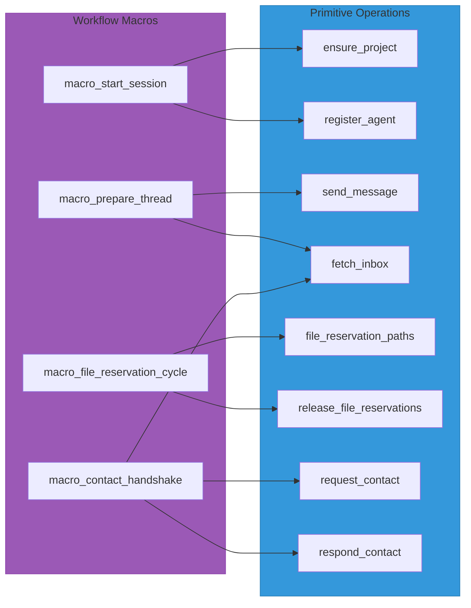

```typescript
interface MacroOperations {
  // Start a session: register agent + initialize archive
  startSession(options: {
    projectSlug: string;
    program: string;
    model: string;
    task?: string;
  }): Promise<{ project: Project; agent: Agent }>;

  // Complete contact handshake flow
  contactHandshake(options: {
    requesterId: number;
    responderName: string;
    responderProjectSlug: string;
  }): Promise<AgentLink>;

  // File reservation cycle: reserve -> work -> release
  fileReservationCycle<T>(options: {
    agentId: number;
    patterns: string[];
    exclusive?: boolean;
    work: () => Promise<T>;
  }): Promise<T>;
}
```

---

## Storage Layer

### Storage Architecture

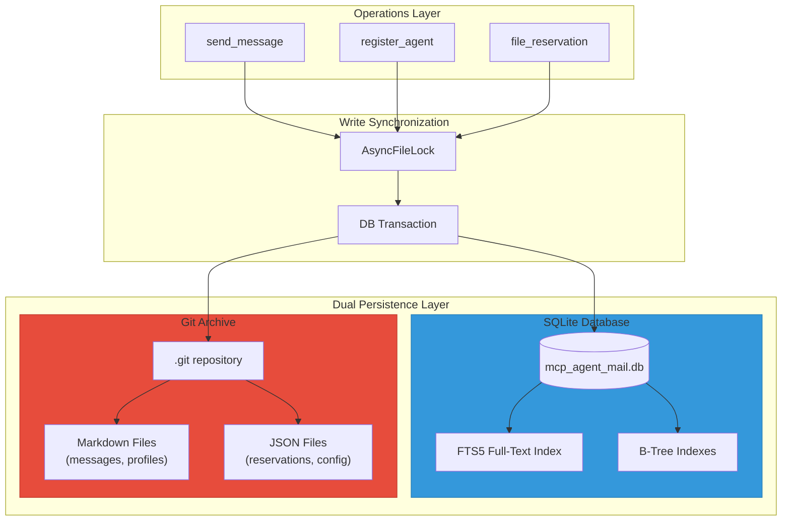

### Dual Persistence Strategy

The system uses **Git + SQLite** for complementary benefits:

| Aspect | SQLite | Git |
|--------|--------|-----|
| Purpose | Fast queries, FTS | Human-auditable history |
| Format | Relational tables | Markdown files + JSON |
| Querying | SQL + FTS5 | Git log, diff |
| Sharing | Single file export | Clone/push |

### File System Layout

```
~/.mcp_agent_mail/
├── mcp_agent_mail.db        # SQLite database
└── archives/
    └── projects/
        └── <project-slug>/
            ├── .git/                    # Git history
            ├── agents/
            │   └── <AgentName>/
            │       ├── profile.json     # Agent metadata
            │       ├── inbox/
            │       │   └── YYYY/MM/<msg-id>.md
            │       └── outbox/
            │           └── YYYY/MM/<msg-id>.md
            ├── messages/
            │   └── YYYY/MM/<msg-id>.md  # Canonical message store
            ├── file_reservations/
            │   └── <sha1-hash>.json     # Active leases
            └── attachments/
                └── <msg-id>/
                    └── <filename>
```

### Storage Interface

```typescript
interface StorageOperations {
  // Initialize project archive
  ensureArchive(projectSlug: string): Promise<ProjectArchive>;

  // Write agent profile
  writeAgentProfile(agent: Agent): Promise<void>;

  // Write message bundle (message + recipient copies)
  writeMessageBundle(message: Message, recipients: Agent[]): Promise<void>;

  // Write file reservation record
  writeFileReservation(reservation: FileReservation): Promise<void>;

  // Process and store attachments
  processAttachments(
    messageId: number,
    attachments: AttachmentInput[]
  ): Promise<Attachment[]>;

  // Get recent commits
  getRecentCommits(
    projectSlug: string,
    since?: Date,
    limit?: number
  ): Promise<Commit[]>;

  // Get file content from archive
  getFileContent(
    projectSlug: string,
    path: string
  ): Promise<string>;

  // Archive-level write lock
  acquireWriteLock(projectSlug: string): Promise<Lock>;
}

interface ProjectArchive {
  slug: string;
  rootPath: string;
  attachmentsDir: string;
}
```

### Locking Strategy

```typescript
interface LockOperations {
  // Acquire async-safe file lock
  acquireLock(lockPath: string, timeout?: number): Promise<AsyncFileLock>;

  // Heal stale locks (cleanup)
  healStaleLocks(projectSlug: string): Promise<number>;

  // Get lock status report
  getLockStatus(projectSlug: string): Promise<LockStatus[]>;
}

interface AsyncFileLock {
  release(): Promise<void>;
  isHeld(): boolean;
  metadata: {
    pid: number;
    hostname: string;
    acquired_ts: Date;
  };
}
```

---

## Database Layer

### Schema Requirements

```typescript
interface DatabaseOperations {
  // Initialize connection pool
  initializePool(options: {
    databaseUrl: string;
    poolSize?: number;
    maxOverflow?: number;
  }): Promise<void>;

  // Ensure schema exists (migrations)
  ensureSchema(): Promise<void>;

  // Get session for transactions
  getSession(): Promise<Session>;

  // Retry decorator for lock contention
  retryOnLock<T>(operation: () => Promise<T>): Promise<T>;
}
```

### Required Indexes

```sql
-- Message queries
CREATE INDEX ix_message_created_ts ON message(created_ts);
CREATE INDEX ix_message_thread_id ON message(thread_id);
CREATE INDEX ix_message_importance ON message(importance);
CREATE INDEX ix_message_sender_created ON message(sender_id, created_ts);
CREATE INDEX ix_message_project_created ON message(project_id, created_ts);

-- Recipient queries
CREATE INDEX ix_recipient_agent ON message_recipient(agent_id);

-- File reservations
CREATE INDEX ix_reservation_expires ON file_reservation(expires_ts);

-- Full-text search (FTS5)
CREATE VIRTUAL TABLE message_fts USING fts5(
  subject, body, content=message
);
```

---

## Configuration

### Settings Interface

```typescript
interface Settings {
  // Environment
  environment: "development" | "production";

  // Database
  database: {
    url: string;
    echo: boolean;
  };

  // Storage
  storage: {
    rootDir: string;
    gitAuthorName: string;
    gitAuthorEmail: string;
    imageConversion: {
      enabled: boolean;
      maxWidth: number;
      maxHeight: number;
      format: "webp" | "png" | "jpeg";
    };
  };

  // File Reservations
  fileReservations: {
    defaultTtlSeconds: number;
    cleanupIntervalSeconds: number;
    enforcement: "warn" | "block";
  };

  // Acknowledgements
  ack: {
    defaultTtlSeconds: number;
    escalationMode: "warn" | "block" | "none";
  };

  // Agent Names
  agentNames: {
    enforcement: "strict" | "coerce" | "always_auto";
  };

  // Messaging Ergonomics
  messaging: {
    autoRegister: boolean;
    autoHandshake: boolean;
  };

  // Logging
  logging: {
    level: "debug" | "info" | "warn" | "error";
    format: "rich" | "json";
    enableTrace: boolean;
  };
}
```

---

## MCP Tool Interface

The library exposes these MCP tools for agent consumption:

### Infrastructure Cluster
| Tool | Description |
|------|-------------|
| `health_check` | Server readiness probe |
| `ensure_project` | Create/retrieve project |
| `install_precommit_guard` | Install git hooks |
| `uninstall_precommit_guard` | Remove git hooks |

### Identity Cluster
| Tool | Description |
|------|-------------|
| `register_agent` | Create agent identity |
| `whois` | Lookup agent profile |
| `create_agent_identity` | Generate unique name |

### Messaging Cluster
| Tool | Description |
|------|-------------|
| `send_message` | Send to recipients |
| `reply_message` | Thread-aware reply |
| `fetch_inbox` | Get messages |
| `mark_message_read` | Update read status |
| `acknowledge_message` | ACK with TTL |

### Contact Cluster
| Tool | Description |
|------|-------------|
| `request_contact` | Initiate contact |
| `respond_contact` | Approve/block |
| `list_contacts` | Get relationships |
| `set_contact_policy` | Set policy |

### Search Cluster
| Tool | Description |
|------|-------------|
| `search_messages` | FTS5 search |
| `summarize_thread` | LLM summary |

### File Reservations Cluster
| Tool | Description |
|------|-------------|
| `file_reservation_paths` | Create leases |
| `release_file_reservations` | Release leases |
| `force_release_file_reservation` | Admin override |
| `renew_file_reservations` | Extend TTL |

### Macros Cluster
| Tool | Description |
|------|-------------|
| `macro_start_session` | Combined setup |
| `macro_prepare_thread` | Thread context |
| `macro_file_reservation_cycle` | Reserve/work/release |
| `macro_contact_handshake` | Full handshake |

---

## Utility Functions

### Agent Name Generation

```typescript
const ADJECTIVES = [
  "Red", "Blue", "Green", "Gold", "Silver", "Bronze", "Amber", "Coral",
  "Jade", "Ruby", "Pearl", "Onyx", "Ivory", "Ebony", "Crimson", "Azure",
  "Swift", "Bold", "Calm", "Keen", "Wise", "Brave", "Noble", "Loyal",
  "Sunny", "Misty", "Stormy", "Frosty", "Dusty", "Rusty", "Mossy", "Dewy",
  // ... 62 total
];

const NOUNS = [
  "River", "Mountain", "Valley", "Forest", "Desert", "Ocean", "Island", "Canyon",
  "Fox", "Eagle", "Wolf", "Bear", "Hawk", "Owl", "Deer", "Lion",
  "Tower", "Bridge", "Castle", "Temple", "Garden", "Harbor", "Meadow", "Summit",
  // ... 69 total
];

function generateAgentName(): string {
  const adj = ADJECTIVES[Math.floor(Math.random() * ADJECTIVES.length)];
  const noun = NOUNS[Math.floor(Math.random() * NOUNS.length)];
  return `${adj}${noun}`;
}

function validateAgentName(name: string): boolean {
  const pattern = /^[A-Z][a-z]+[A-Z][a-z]+$/;
  if (!pattern.test(name)) return false;

  // Check if it's a valid adjective+noun combination
  for (const adj of ADJECTIVES) {
    if (name.startsWith(adj)) {
      const noun = name.slice(adj.length);
      if (NOUNS.includes(noun)) return true;
    }
  }
  return false;
}
```

### Slugification

```typescript
function slugify(input: string): string {
  return input
    .toLowerCase()
    .replace(/[^a-z0-9]+/g, "-")
    .replace(/^-+|-+$/g, "")
    .slice(0, 64);
}
```

---

## Optional Features

These can be implemented as separate modules:

### LLM Integration
- Thread summarization
- Sibling project suggestions
- Intelligent routing

### Git Guard System
- Pre-commit hooks for file reservation enforcement
- Pre-push validation
- Chain runner for hook plugins

### Share/Export System
- Static bundle generation
- Offline viewer
- Secret scrubbing
- Manifest signing

### HTTP Transport
- FastAPI/Express server wrapper
- JWT/Bearer authentication
- Rate limiting
- CORS configuration

---

## Implementation Priority

### Implementation Roadmap

```mermaid
gantt
    title Library Implementation Phases
    dateFormat X
    axisFormat %s

    section Phase 1: Core MVP
    Data models & types           :p1a, 0, 1
    SQLite database layer         :p1b, after p1a, 1
    Basic storage (no Git)        :p1c, after p1b, 1
    Agent registration            :p1d, after p1c, 1
    Message send/receive          :p1e, after p1d, 1
    Inbox fetching                :p1f, after p1e, 1

    section Phase 2: Coordination
    File reservations             :p2a, after p1f, 1
    Conflict detection            :p2b, after p2a, 1
    TTL enforcement               :p2c, after p2b, 1
    Lock management               :p2d, after p2c, 1

    section Phase 3: Social
    Contact management            :p3a, after p2d, 1
    Cross-project messaging       :p3b, after p3a, 1
    Policy enforcement            :p3c, after p3b, 1

    section Phase 4: Advanced
    Git-backed storage            :p4a, after p3c, 1
    Full-text search              :p4b, after p4a, 1
    Workflow macros               :p4c, after p4b, 1
    Product bus                   :p4d, after p4c, 1

    section Phase 5: Optional
    HTTP server                   :p5a, after p4d, 1
    LLM integration               :p5b, after p5a, 1
    Guard system                  :p5c, after p5b, 1
    Export/share                  :p5d, after p5c, 1
```

### Module Dependency Graph

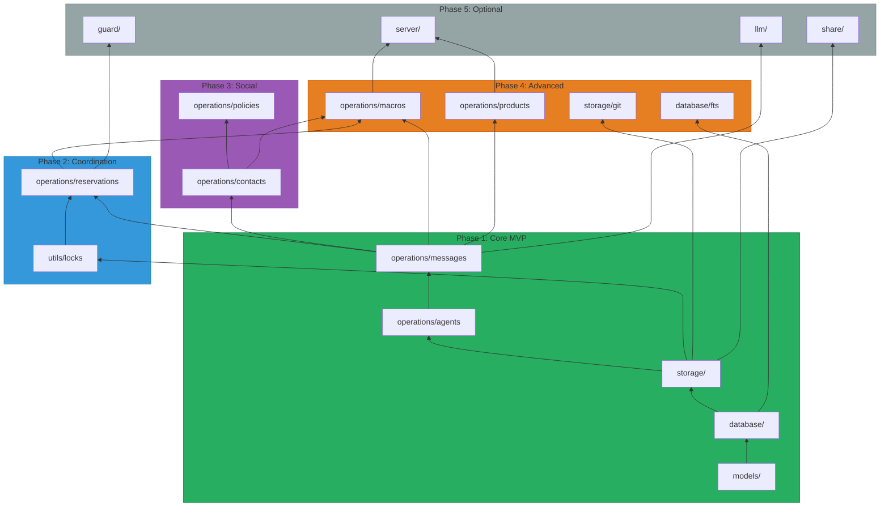

### Phase 1: Core (MVP)
1. Data models and types
2. SQLite database layer
3. Basic storage (no Git)
4. Agent registration
5. Message send/receive
6. Inbox fetching

### Phase 2: Coordination
1. File reservations
2. Conflict detection
3. TTL enforcement
4. Lock management

### Phase 3: Social
1. Contact management
2. Cross-project messaging
3. Policy enforcement

### Phase 4: Advanced
1. Git-backed storage
2. Full-text search
3. Workflow macros
4. Product bus

### Phase 5: Optional
1. HTTP server
2. LLM integration
3. Guard system
4. Export/share

---

## JavaScript/TypeScript Considerations

### Async Patterns
- Use `async/await` throughout
- Consider `AsyncLocalStorage` for request context
- Use `p-limit` for concurrency control

### Database Options
- **better-sqlite3**: Sync, fast, good for single-process
- **sql.js**: WASM-based, browser-compatible
- **Prisma/Drizzle**: ORM with migrations

### File System
- Use `fs/promises` for async operations
- Consider `chokidar` for file watching
- Use `simple-git` for Git operations

### Locking
- Use `proper-lockfile` for cross-process locks
- Implement retry with exponential backoff

### MCP SDK
- Use `@anthropic-ai/sdk` for MCP protocol
- Implement tool handlers with Zod validation

---

## Source File Reference

| Python File | Lines | JavaScript Equivalent |
|-------------|-------|----------------------|
| `models.py` | 138 | `src/models/` |
| `db.py` | 293 | `src/database/` |
| `storage.py` | 1,846 | `src/storage/` |
| `config.py` | 342 | `src/config/` |
| `utils.py` | 217 | `src/utils/` |
| `app.py` | 8,283 | `src/operations/` + `src/tools/` |
| `http.py` | 2,803 | `src/server/` |
| `llm.py` | 276 | `src/llm/` (optional) |
| `guard.py` | 611 | `src/guard/` (optional) |
| `share.py` | 2,206 | `src/share/` (optional) |

**Total Python LOC**: ~22,000
**Estimated JS/TS LOC**: ~15,000-18,000 (less boilerplate)
